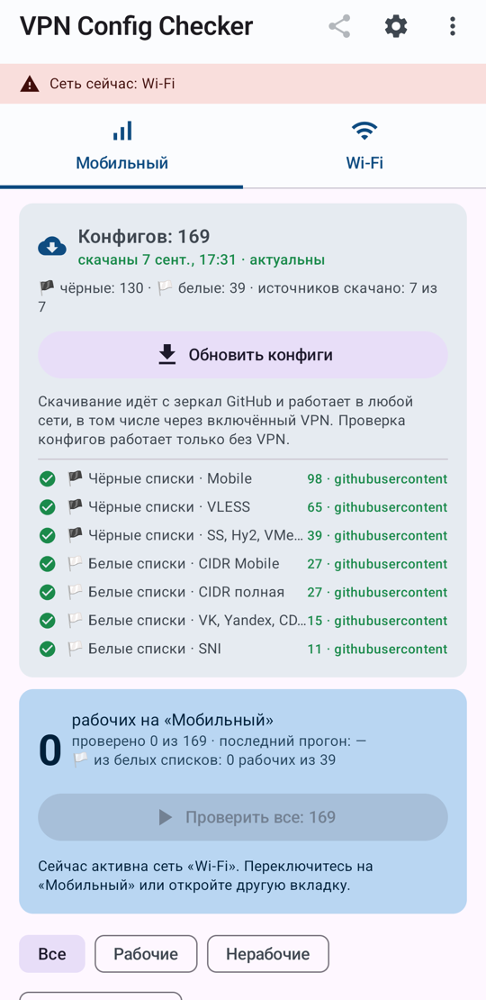
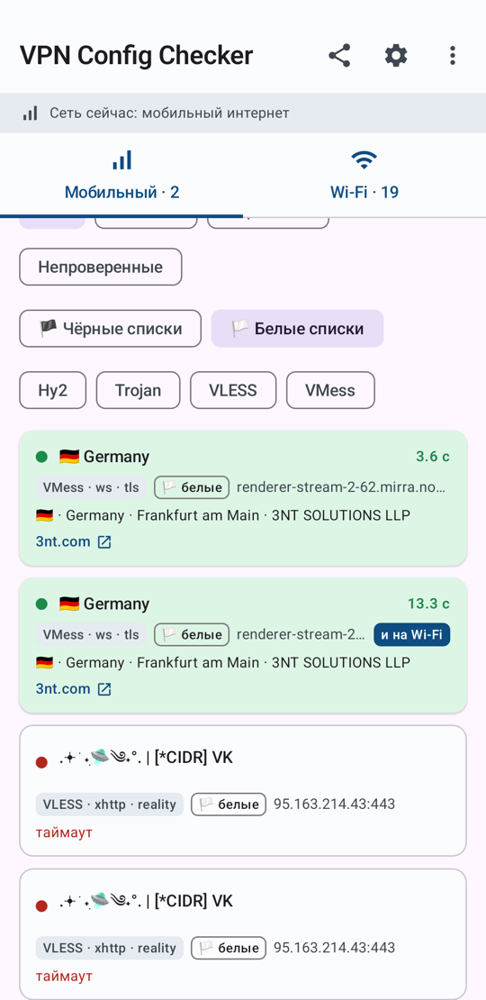
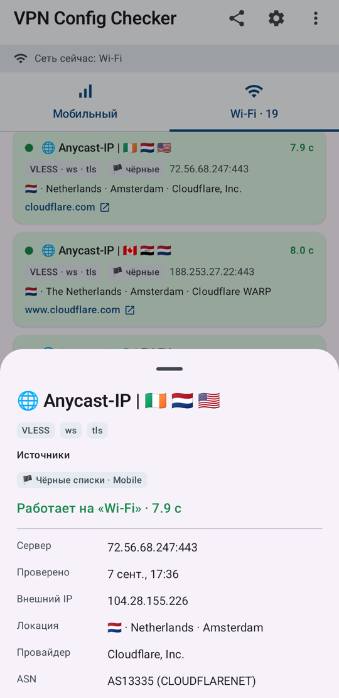

# VPN Config Checker

[Русский](README.md) · **English**

Tests free VPN configs from public subscription lists right on your phone and shows which of them
work right now on your network. Mobile data and Wi‑Fi are tracked separately.

> Free configs don't live long. They are someone else's servers shared by thousands of people; they get
> blocked, overloaded and rotated out of the lists. What worked yesterday may not connect today.
> The app has no servers of its own, it only shows which of the free ones work for you at the moment.
> Re-check before you rely on one.

## Download

[Download APK](https://github.com/Narwa1ly/vpn-config-checker/releases/latest/download/vpn-config-checker.apk) —
Android 8+, arm64 only (practically any phone made after 2016), about 50 MB.
All versions and checksums are in [Releases](https://github.com/Narwa1ly/vpn-config-checker/releases).

## Screenshots

<p>
  
  
  
</p>

The UI is in Russian.

## Why

The configs come from [igareck/vpn-configs-for-russia](https://github.com/igareck/vpn-configs-for-russia):
a few hundred VLESS, VMess, Trojan, Shadowsocks and Hysteria2 links in "black-list" and "white-list"
editions, refreshed hourly. The maintainer tests them from his server, but every carrier sees a different
picture, and trying hundreds of links by hand in a client takes forever. The app tries them for you and
puts the working ones on top.

It also:

- keeps results for mobile data and Wi‑Fi apart and marks configs that work on both;
- tags white-list configs (servers in whitelisted subnets of Russian hosting providers) and checks them
  first on mobile networks;
- shows country, city, hosting provider and its website for every working config, based on the exit IP;
- downloads the lists over any network, including through an active VPN, so you can check later on mobile data.

It is not a VPN client. Nothing is tunneled and no network settings are touched. Copy the working links into
your usual client: v2rayNG, Happ, Hiddify, NekoBox, Streisand or anything else.

## How to use

1. Install the APK, open the app, allow notifications (check progress is shown there).
2. Tap "Скачать конфиги" (download configs).
3. Pick the "Мобильный" (mobile) or "Wi‑Fi" tab, connect to that network, turn your VPN off and tap
   "Проверить все" (check all). The "Рабочие" (working), "Белые списки" (white lists) and protocol chips
   narrow the list; "Проверить показанные" checks only what is filtered.
4. Open a working config and copy the link into your client. The share button in the top bar exports all
   working links as one text.

Repeat in a day or two: some configs will be dead, new ones will show up.

## How it works

For every config a separate Xray-core or sing-box process is started with a local proxy, and api.2ip.io is
loaded through it. A response means the config works; the exit IP, country and ASN come from that response.
Hysteria2, Shadowsocks and configs with allowInsecure go through sing-box, everything else through Xray.

Subscriptions are fetched from several mirrors at once, the first valid answer wins. Configs that vanished from
the lists and never worked are dropped on the next download; working ones stay until they fail a check.
Failed ones can be deleted from the menu.

Provider lookup by exit IP: ipwho.is first, then ip-api.com, then a built-in ASN table.

Project layout and design notes (in Russian): [docs/ARCHITECTURE.md](docs/ARCHITECTURE.md).

## Building

JDK 17 and the Android SDK (platform 35, build-tools 35) are required.

```bash
./scripts/fetch-cores.sh      # Xray-core and sing-box binaries into jniLibs
./gradlew assembleDebug       # app/build/outputs/apk/debug/app-debug.apk
./gradlew testDebugUnitTest
```

Releases are built by GitHub Actions on `v*` tags.

## Limitations

- arm64 only: Xray-core has no 32-bit ARM builds for Android.
- ssr://, tuic://, wireguard:// and Shadowsocks with plugins are not supported.
- "Works" means 2ip.io opened through the config. Bandwidth is not measured.
- sing-box is built for 4 KB memory pages and may fail to start on Android 15 in 16 KB mode.

## Licenses

[Xray-core](https://github.com/XTLS/Xray-core) (MPL-2.0) and [sing-box](https://github.com/SagerNet/sing-box)
(GPL-3.0) are used as separate processes. The config lists belong to their authors and are downloaded at runtime.
